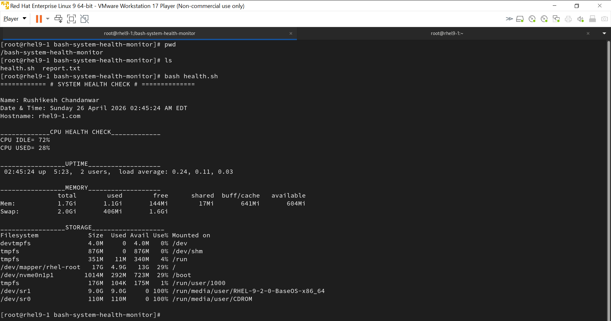

# 🖥️ Bash System Health Monitor

Monitors CPU, RAM, Disk, and Services on RHEL9/CentOS.
Auto-saves report. Cron-scheduled every 5 minutes.

## What it checks
- CPU idle & used %
- RAM usage
- Disk usage
- Service status (sshd, crond, firewalld)

## Usage
```bash
bash health.sh
```

## Cron Setup
```bash
*/5 * * * * /bin/bash /root/health.sh >> /root/report.txt 2>&1
```
## Technologies Used
- Linux
- Bash Scripting
- Cron Jobs

## Environment
Tested on RHEL 9

## Output Screenshot

